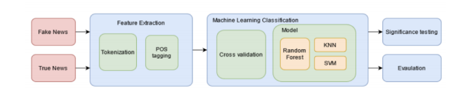

# Investigating the Differences in Syntax Between Real and Fake News Article Titles

Our research aims to identify the syntactical differences between the titles of fake news and real news articles. We aim to do this by extracting syntactic features such as nouns, verbs, and pronouns from the titles in our dataset, and analyzing the relative presence or absence of each of these features across
both categories of news titles, as well as their effectiveness in classifying article titles as pertaining to real or fake news. In addition, we aim to identify whether the syntactic structure of a title is significant in differentiating between real news titles and fake news titles. This is something unexplored in prior
literature and is the key insight we hope to extract from conducting this research. 

Our hypotheses are:
1. News article titles can be identified as real or fake news article titles through analysis of their
syntactic features alone.
2. The overall syntactic structure of a news article title is a strong predictor in classifying real and
fake news article titles, and will improve the performance of trained classifiers. 

We plan to implement machine learning classification models that will predict whether a news article title is that of a real news article or a fake news article. We will first train our models on a feature set that does not include the overall syntactic structure feature. If our classifiers trained on this feature set return high classification performance this will confirm our first hypothesis. For this hypothesis to be confirmed, we will evaluate our models on their precision, recall, and f-measure scores (Perotte et al.,2014), as well as their accuracy and AUC scores (Brown, 2018). High precision, recall, and f-measure scores are desired for a strong classifier (Huang et al., 2005), along with a high AUC score (Wu et al.,2017) and high accuracy. 

Therefore, the passing criteria for our classification models to confirm our first hypothesis are >90% scores for all five models’ evaluation metrics.
We will then train our classification models on a feature set that includes the overall syntactic structure of each article title. If there is a significant improvement in the performance of the first set of models and this new set of models, it will confirm our second hypothesis. This will be assessed by performing a
t-test, which is a widely-used statistic to assess whether a performance improvement between two models is significant or not (Wagstaff, 2012). If the p-value computed from this t-test is less than or equal to 0.05 (5%), the performance difference between the models trained on the dataset with and without the syntactic structure feature is not significant enough to say that the overall syntactic structure of a title is a strong predictor of real versus fake news article titles, and our second hypothesis will be falsified.

However, if the p-value is larger than 0.05, the performance improvement between each pair in the two
sets of models is significant and we will confirm our second hypothesis.

# Methodology:

 

# Conclusion:

This work focused on whether the syntax of a news article title would provide predictive power in classifying the article title as belonging to real news or fake news. The current state of the art covers many features that could be extracted to predict such a category, however, the research gap we identified was to
classify the article titles based on their syntactic features alone and investigate the importance of the syntactic structure of the title. Our results indicate that the syntactic features of a news article headline are extremely effective in classifying article titles as pertaining to real or fake news, with each of our trained
classification models achieving accuracy scores above 90%, but that the overall syntactic structure of the title is not a strong predictive feature. 

Our research therefore suggests that real and fake news article titles differ significantly in terms of their syntax, particularly in their syntactic features, which allows for
them to be classified to a high level of accuracy through analysis of these syntactic features alone. One factor contributing to the falsification of our second hypothesis may be the large variance that exists among article title lengths. This means that although two article titles may be extremely similar in syntactic structure, the addition of an extra word at the end of one of the titles will cause them to be classed as having entirely different syntactic structures. Therefore, one area of future work we identified
is to incorporate title length when generating the syntactic structure feature in order to capture similarities in syntactic structure for non-identically structured titles.
Another piece of future work we identified is to incorporate the ’Subject’ field of the articles as a feature to the classification models, and investigate its impact on identifying article titles as pertaining to real or fake news, as well as identifying the most common themes among both real and fake news.
